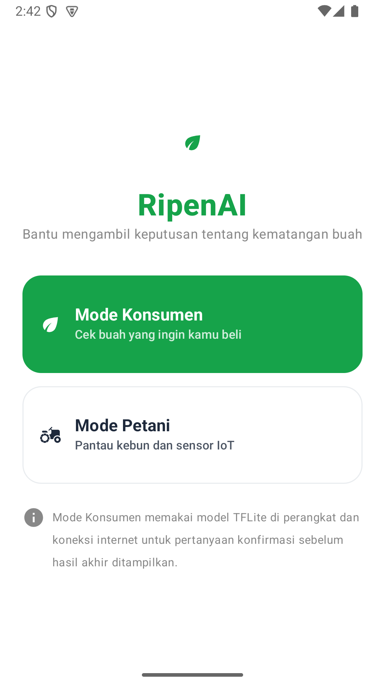
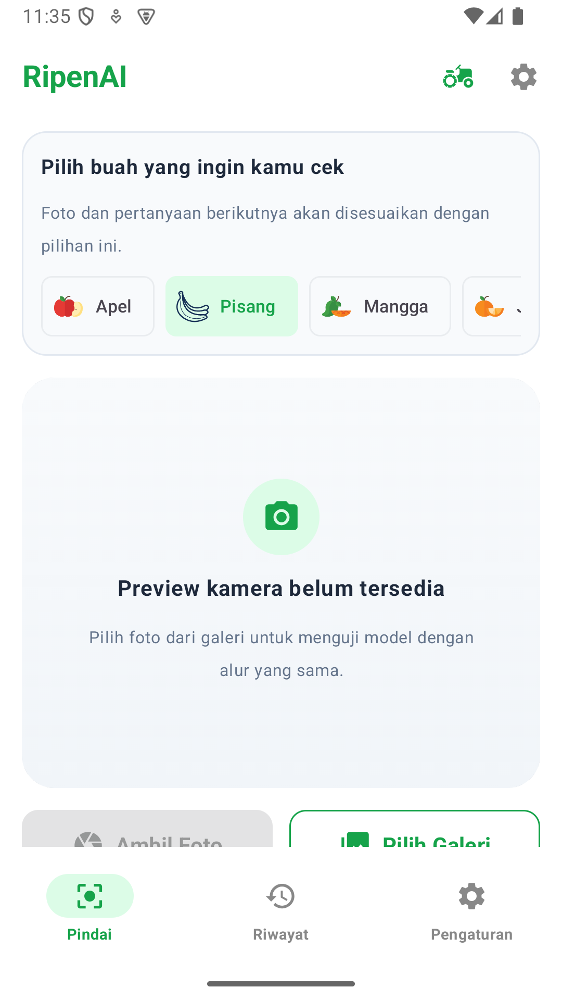

# RipenAI

RipenAI is an AI-assisted fruit inspection platform for two real-world problems:

1. Consumers need a practical way to choose fruit that is unripe, ripe, overripe, or visibly spoiled.
2. Farmers need better visibility into fruit condition so produce is not forgotten until it loses selling value.

The project combines an Android application, on-device computer vision, a Cloudflare question worker, and a reproducible GPU training/evaluation pipeline.

> Current delivery focus: both mode entry points are implemented. Consumer mode is the vision/question/fusion workflow; farmer mode is an offline-first multi-container sensor dashboard with transparent rules plus Farmer ML V1 trained on challenging synthetic sensor trajectories.

## What the app does

### Consumer mode

- Selects the fruit before analysis so the classifier cannot silently turn a selected banana into an apple result.
- Captures an image with CameraX or selects one from the gallery.
- Runs the primary MobileNetV2 TFLite model locally on the device.
- Runs a separate visual safety detector for visible spoilage/rotten signals.
- Requires online confirmation questions from the Cloudflare Worker before producing a final consumer result.
- Fuses visual evidence and answers through `FusionEngine`.
- Shows a clean Indonesian-language result for `Mentah`, `Matang`, `Terlalu Matang`, and `Busuk`.
- Saves scan history locally with Room and exposes consumer-focused settings.

### Farmer mode

- Registers multiple fruit containers, each with its own ESP32 IP/SSID and Room cache.
- Pulls `/status` and incremental `/data?since=<timestamp>` readings from the unit over local WiFi.
- Keeps stale readings visible when the unit is unreachable and deduplicates history by `containerId + timestamp`.
- Shows temperature, humidity, gas, several-days trend lines, last sync state, and a clear recommendation.
- Calculates risk v1 locally from configured gas-rate, humidity, and temperature bands.
- Runs the Farmer ML V1 TFLite recommender on a 32-reading window trained on difficult synthetic DHT22 + MQ-3 proxy trajectories. The rule engine remains primary; the model contributes only 25% when confidence is at least 65% and can expose an estimated action horizon.
- Learns gradually from explicit farmer feedback through a bounded, local calibration layer. The base neural weights remain frozen on the phone to avoid catastrophic updates.
- Includes local threshold-crossing/stale reminders with a six-hour cooldown and a clearly labeled demo dataset for emulator evaluation without hardware.

The current farmer workflow is ready for integration testing with the real firmware in [`firmware/esp32_ripenai/`](firmware/esp32_ripenai/). Automatic Android WiFi provisioning and hardware calibration remain deployment work because they depend on the final ESP32 hardware and device permissions.

## Architecture

```text
Android / Jetpack Compose
        |
        +--> CameraX or Gallery
        |       |
        |       +--> Primary TFLite model: fruit + ripeness
        |       +--> Rotten detector: visible spoilage safety signal
        |
        +--> Cloudflare Question Worker
                |
                +--> Groq AI
                +--> Cloudflare Workers AI fallback
                +--> Rule-based fallback with diagnostics
        |
        +--> FusionEngine
                |
                +--> Result screen
                +--> Room history
                +--> Consumer settings

ESP32 unit per container
        |
        +--> Local WiFi HTTP: /ping, /status, /data?since=...
        +--> FarmerRepository --> Room container + sensor history cache
        +--> FarmerRiskEngine --> transparent score + conservative merge
        +--> FarmerRiskPredictor --> Farmer ML V1 (TFLite)
        +--> dashboard, trend, recommendation, threshold-crossing reminders
```

The Groq secret stays in Cloudflare. It is never shipped in the APK.

### How the consumer result is calculated

The consumer flow does not use the language model as a hidden final classifier:

1. The selected gallery or camera bitmap is classified on-device by the primary TFLite model and the visible-spoilage detector.
2. The Worker receives the visual stage, confidence, and second candidate, then returns exactly three confirmation questions.
3. The final result is blocked until every question is answered. Android then calculates the fusion score locally:

   `score = clamp(base stage score + CV confidence contribution + answer contribution, 0, 1)`

   The displayed confidence combines 65% visual confidence and 35% fusion score. Rotten signals remain safety-preserving and produce a do-not-consume recommendation.

The Worker now attaches an explicit `option_scores` array to every question. Android applies those scores even when the LLM uses dynamic IDs such as `q1`, `q2`, and `q3`; the older position-based calculation remains only as a compatibility fallback for responses from an older Worker deployment.

### How the farmer result is calculated

The farmer mode does not ask an LLM to infer sensor risk. Android retrieves the newest readings from each local unit, stores them idempotently in Room, and calculates a transparent rule score from recent gas change per hour plus average humidity and temperature. Thresholds are bundled in [`farmer_config.json`](android-app/app/src/main/assets/farmer_config.json), so they can be reviewed and calibrated without hiding values in Kotlin code. Farmer ML V1 adds a 25% signal from a 32-reading window and returns risk, class probabilities, and an estimated action horizon. It is trained only on difficult synthetic DHT22/MQ-3 proxy trajectories and must not be presented as field accuracy. Explicit farmer labels update a bounded per-fruit calibration layer locally; the base TFLite weights remain frozen. The result is a decision aid; the recommendation always asks the farmer to inspect the fruit before selling or consuming it. See [`docs/TECH-farmer-ml-v1.md`](docs/TECH-farmer-ml-v1.md).

### Camera behavior

On a physical device with camera permission, CameraX binds both the live preview
and `ImageCapture` to the back camera. Captured JPEGs are normalized from EXIF
orientation before they enter the same analysis pipeline used by gallery images.
The emulator intentionally presents a clear “Preview kamera belum tersedia”
state, so gallery selection is the honest test path there; a final hardware smoke
test still needs to be run on a real Android phone before release.

## UI snapshots

| Mode selection | Consumer scan |
| --- | --- |
|  |  |

The final `Busuk` safety flow is captured in [`docs/screenshots/consumer-rotten-safety.png`](docs/screenshots/consumer-rotten-safety.png), and the consumer settings screen is available at [`docs/screenshots/consumer-settings.png`](docs/screenshots/consumer-settings.png).

Fruit selector icons are bundled locally as source-derived CC0 assets. Their source
links and license notes are recorded in [`docs/fruit-icon-attribution.md`](docs/fruit-icon-attribution.md).

## Current ML system

The Android build deliberately uses two models rather than forcing a sparse four-state classifier to do everything:

| Component | Role | Current validation |
| --- | --- | ---: |
| `ripenai.tflite` | 21-class fruit/ripeness model: 7 fruits × 3 stages | 85.74% exact internal test accuracy |
| `rotten_detector.tflite` | Binary visible-spoilage safety detector | 96.79% internal accuracy; 95.06% rotten precision; 94.51% rotten recall |

The primary visual model currently covers apples, bananas, mangoes, oranges, papayas, pineapples, and tomatoes. Avocado is kept in the catalog as a question-based flow because the provided avocado source is tabular rather than a reliable image corpus; the app does not pretend that it has visual avocado classes.

The external BananaImageBD holdout reached 92.56% banana-stage accuracy after fruit selection, with one global non-banana prediction out of 820 samples. The spoilage detector is a conservative visual signal, not a food-safety guarantee; poor lighting, occlusion, cut fruit, and noisy labels still require human judgment.

Full metrics, confusion matrices, threshold analysis, and the four-stage experiment are documented in [`outputs/MODEL_VALIDATION_REPORT.md`](outputs/MODEL_VALIDATION_REPORT.md).

## Data

The pipeline supports the four provided Kaggle sources:

- [Fruit Ripeness: Unripe, Ripe, and Rotten](https://www.kaggle.com/datasets/leftin/fruit-ripeness-unripe-ripe-and-rotten)
- [Fruits Ripeness Classification](https://www.kaggle.com/datasets/asadullahprl/fruits-ripeness-classification-dataset)
- [Avocado Ripeness Classification](https://www.kaggle.com/datasets/amldvvs/avocado-ripeness-classification-dataset)
- [RipeNet 2.0 Fruit Dataset](https://www.kaggle.com/datasets/alexcj10/ripenet-2-0-fruit-dataset)

The additional banana holdout is [BananaImageBD](https://huggingface.co/datasets/Project-AgML/BananaImageBD_ripeness_classification). Its local source notes are in [`data/raw_external/README.md`](data/raw_external/README.md).

Dataset archives and processed images are intentionally not source-controlled. Verify each dataset's license and redistribution terms before publishing or packaging the data outside this workspace.

## Repository layout

```text
android-app/            Android Studio project
  app/src/main/assets/  Final TFLite models and runtime metadata
cloudflare-worker/      Cloudflare Worker for confirmation questions
  src/                  Groq/Workers AI question endpoint and fallback logic
scripts/                Dataset, training, conversion, and evaluation tools
data/                   Dataset inputs and deterministic processed splits
outputs/                Local model reports and training artifacts
docs/                   Product, UX, SRS, and ML contracts
```

Important Android files:

- `android-app/app/src/main/java/com/ripenai/data/repository/FarmerRepository.kt` — local ESP32 sync and multi-container persistence.
- `android-app/app/src/main/java/com/ripenai/domain/FarmerRiskEngine.kt` — configured, explainable farmer risk calculation.
- `android-app/app/src/main/java/com/ripenai/domain/FarmerRiskPredictor.kt` — Farmer ML V1 TFLite inference and metadata validation.
- `android-app/app/src/main/java/com/ripenai/domain/FarmerOnlineCalibrator.kt` — bounded per-fruit feedback calibration stored locally on the phone.
- `android-app/app/src/main/java/com/ripenai/ui/FarmerViewModel.kt` — farmer polling, alerts, demo data, and dashboard state.
- `android-app/app/src/main/java/com/ripenai/ui/screens/FarmerModeScreen.kt` — farmer dashboard, detail trend, and add-container UI.

- `android-app/app/src/main/java/com/ripenai/MainActivity.kt` — app shell, splash, mode routing, and navigation.
- `android-app/app/src/main/java/com/ripenai/domain/TFLiteClassifier.kt` — primary model and rotten detector inference.
- `android-app/app/src/main/java/com/ripenai/domain/QuestionGenerator.kt` — strict Worker response handling.
- `android-app/app/src/main/java/com/ripenai/domain/FusionEngine.kt` — visual/question fusion and safety result handling.
- `android-app/app/src/main/java/com/ripenai/ui/RipenViewModel.kt` — scan state, history, and mode orchestration.

## Requirements

- Android Studio with the bundled JDK 11 runtime.
- Android SDK with API 36 available.
- Python 3.10+ for dataset and evaluation tooling.
- Node.js and npm for the Cloudflare Worker.
- A CUDA-capable NVIDIA driver and CUDA-enabled PyTorch build for GPU training.
- Kaggle credentials only when downloading the Kaggle archives.

The validated training machine used an NVIDIA GeForce MX450 with PyTorch CUDA and automatic mixed precision. TensorFlow remains useful for TFLite evaluation and legacy export tools, but the promoted model was trained with native PyTorch CUDA.

## Run the Android app

```powershell
cd android-app
.\gradlew.bat :app:testDebugUnitTest --no-daemon
.\gradlew.bat :app:assembleDebug --no-daemon `
  -PQUESTION_API_URL="https://yourwoker.workers.dev/v1/questions"
```

The debug APK is generated at:

```text
android-app/app/build/outputs/apk/debug/app-debug.apk
```

For a local Worker running on the host machine, use the Android emulator gateway:

```powershell
cd android-app
.\gradlew.bat :app:assembleDebug `
  -PQUESTION_API_URL="http://10.0.2.2:8787/v1/questions"
```

## Run the question Worker

```powershell
cd cloudflare-worker
npm install
Copy-Item .dev.vars.example .dev.vars
# Put GROQ_API_KEY in .dev.vars for local development.
npm run typecheck
npm run dev
```

Deploy after authenticating Wrangler and storing the secret:

```powershell
npx wrangler login
npx wrangler secret put GROQ_API_KEY
npm run deploy
```

The Worker tries Groq first, then Cloudflare Workers AI. If both providers fail or return invalid JSON, it returns a validated rule-based question set with provider diagnostics instead of leaking a 503 to the Android client.

## Train and evaluate with the GPU

Create a virtual environment and install the base tooling first. Install the CUDA-enabled PyTorch and torchvision versions compatible with the local NVIDIA driver, then run:

```powershell
py -m venv .venv
.\.venv\Scripts\Activate.ps1
python -m pip install -r requirements.txt
# Install the matching CUDA-enabled torch/torchvision build from pytorch.org.

python scripts/download_datasets.py
python scripts/prepare_dataset.py

$env:RIPEN_NATIVE_BATCH_SIZE="32"
$env:RIPEN_NATIVE_WORKERS="4"
$env:RIPEN_NATIVE_HEAD_EPOCHS="2"
$env:RIPEN_NATIVE_FINE_EPOCHS="1"
python scripts/train_native_cuda.py

$env:RIPEN_ROTTEN_BATCH_SIZE="32"
$env:RIPEN_ROTTEN_WORKERS="4"
$env:RIPEN_ROTTEN_HEAD_EPOCHS="3"
$env:RIPEN_ROTTEN_FINE_EPOCHS="1"
python scripts/train_rotten_detector_cuda.py

# Farmer ML V1 recommender (synthetic bootstrap; uses CUDA PyTorch)
python scripts/generate_farmer_synthetic.py --samples 12000
python scripts/train_farmer_model_cuda.py --epochs 40
python scripts/convert_farmer_onnx_to_tflite.py `
  --input outputs/farmer_model_v1_cuda/farmer_risk_cuda.onnx `
  --output outputs/farmer_model_v1_tflite `
  --feature-dim 105
python scripts/evaluate_farmer_tflite.py
```

The native CUDA trainer exports ONNX and the primary TFLite candidate. The rotten detector can be converted with:

```powershell
python scripts/convert_onnx_to_tflite.py `
  --input outputs/rotten_detector_cuda.onnx `
  --output outputs/rotten_detector_tf
```

Use `scripts/analyze_model.py`, `scripts/evaluate_external.py`, `scripts/evaluate_rotten_detector.py`, and `scripts/evaluate_farmer_tflite.py` to regenerate metrics and charts. Copy `outputs/farmer_model_v1_tflite/farmer_risk.tflite` and `outputs/farmer_model_v1_cuda/farmer_model_config.json` into `android-app/app/src/main/assets/` as `farmer_risk.tflite` and `farmer_model_config.json`. Real, calibrated sensor logs and manual fruit-condition labels are required before making a production accuracy claim. The full V1 contract is in [`docs/TECH-farmer-ml-v1.md`](docs/TECH-farmer-ml-v1.md).

For a local ESP32-compatible demo without hardware, choose one of these connection paths.

With the Android phone connected by USB, use ADB reverse. In the app add a wadah with IP `127.0.0.1:8080`; leave SSID empty:

```powershell
python scripts/farmer_demo.py --host 127.0.0.1 --port 8080 --fruit banana --scenario mixed_stress
adb reverse tcp:8080 tcp:8080
```

Jika ada lebih dari satu device, tambahkan `-s <device_serial>` pada perintah ADB.

For a phone and computer on the same WiFi, bind the demo to the LAN and enter the computer's IPv4 address plus port in the app (for example `192.168.18.15:8080`). The SSID must be the WiFi name currently used by the phone; allow TCP port 8080 through the Windows private-network firewall if prompted:

```powershell
python scripts/farmer_demo.py --host 0.0.0.0 --port 8080 --fruit banana --scenario mixed_stress
ipconfig
```

To print a single payload without starting a server:

```powershell
python scripts/farmer_demo.py --once --fruit banana --scenario mixed_stress
```

The real Arduino firmware is in [`firmware/esp32_ripenai/`](firmware/esp32_ripenai/); it serves the same `/ping`, `/status`, `/data`, `/config`, and `/led` contract over the unit's local WiFi AP.

## Validation and quality gates

```powershell
cd android-app
.\gradlew.bat :app:testDebugUnitTest --no-daemon
cd ..
cd cloudflare-worker
npm run typecheck
```

The final Android smoke test confirmed that both TFLite interpreters load on the emulator without an application crash. The repository also keeps the visual reports under `outputs/` for review.

## Product status and next steps

Completed:

- Consumer flow from camera/gallery to model, online questions, fusion, result, and history.
- Fruit-selection gating to prevent cross-fruit labels such as banana becoming apple.
- Separate visible-spoilage detector and explicit `Busuk` safety handling.
- Cloudflare 503 fallback hardening and provider diagnostics.
- GPU training, external banana holdout evaluation, confusion matrices, and threshold sweep.
- Cleaner header, large camera surface, friendly splash copy, and consumer-focused settings.
- Farmer mode V1: multi-container dashboard, local ESP32 sync, Room history, risk trend chart, demo data, transparent rules, Farmer ML V1 TFLite model, local feedback calibration, action-horizon display, and threshold-crossing reminders.

Next:

- Expand the visual model only when each new fruit has enough stage-balanced, license-cleared images.
- Validate ESP32 firmware responses, sensor calibration, and WiFi auto-connect on physical hardware.
- Continue collecting calibrated DHT22/MQ-3 logs paired with manual fruit-condition labels; compare Farmer ML V1 against the rule baseline before changing the conservative merge weights. The OOD urgent recall is intentionally only 47.6%, so field calibration is still mandatory.
- Add automated Worker integration tests and a repeatable Android screenshot/regression suite.
- Add privacy policy, release signing, crash reporting, and production observability before public release.

## License

This project licensed under MIT License
